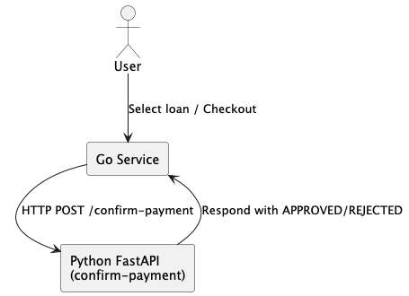
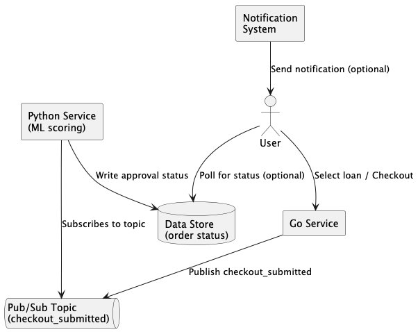

# loan-buddy

> A Go microservice that simulates loan offer aggregation from multiple providers. Since this is a personal project the data is mocked.

## Features

* GET /offers – returns aggregated, sorted mock loan offers

* POST /offers – accepts a new loan offer (demo purposes)

* Exposes API via Echo framework

* Dockerized & deployed to Kubernetes (Kind)

* Helm chart for cloud-native packaging

* GitHub Actions CI pipeline

* Simulated GCP infrastructure with Terraform

---

## Architecture

The system consists of two main services:

* **Go Backend**: Handles loan offers, user checkout.
* **Python FastAPI Service**: Simulates external confirmation (eg. payment)

### User Flow

In the current design, the Go service directly calls the Python FastAPI service over HTTP to receive approval status in real time.



This synchronous design is simple and effective for interactive use cases, where the user expects an immediate response (eg. checkout confirmation).

However, in a scalable production system, this flow would be refactored into a decoupled architecture using asynchronous communication:

* The Go service publishes a `checkout_submitted` event to a queue like Google Pub/Sub.
* The Python service subscribes to this event stream, performs async scoring and writes status to a data store.
* User can:
  * Poll status
  * Or receive a notification (eg. email)



---

## API Endpoints

### GET /offers

Returns aggregated offers from 3 mock providers, sorted by interest rate.

```shell
curl -X GET http://localhost:8080/offers 
```

```json
[
  { "id": "offer2", "provider": "ProviderB", "rate": 2.9, "amount": 12000 },
  { "id": "offer2", "provider": "ProviderA", "rate": 3.5, "amount": 10000 },
  ...
]
```

### POST /offers

Accepts a JSON offer and echoes it back.

```shell
curl -X POST http://localhost:8080/offers \
  -H "Content-Type: application/json" \
  -d '{"provider":"TestProvider","rate":3.7,"amount":8000}'
```

---

## Running Locally

### Run with Go

```shell
# Run application
go run cmd/loanbuddy/main.go
# Run tests
go test ./...
# Run tests with coverage
go test ./... -cover
```

### Run with Docker

```shell
docker build -t loan-buddy .
docker run -p 8080:8080 loan-buddy
```

### Run in Kubernetes (Kind)

```shell
# Build and load into kind
docker build -t loan-buddy .
kind load docker-image loan-buddy

# Install with Helm
helm install loan-buddy ./helm/loan-buddy

# Access via port-forward
kubectl port-forward svc/loan-buddy 8080:8080
curl http://localhost:8080/offers
```

---

## CI/CD

### Github Actions

The Github Actions workflow runs all tests and builds the Docker image. Check out `.github/workflow/ci.yaml`.

### Deployment to GCP using Terraform

The `terraform/` folder defines how a GKE cluster would be provisioned in GCP, simulationg the infrastructure that would host the Loan Buddy microservice.

```shell
cd terraform
terraform init
terraform plan
```

Note: No credentials are needed because the actual GKE cluster is never deployed in order to keep the project free.

---

## Ideas

To improve project:

* [ ] Replace mock data with actual third-party APIs
* [ ] Store data in a real database
* [ ] Move approval to async (Pub/Sub) for decoupling
* [ ] Add authentication
* [ ] Do an actual deployemnt to GKE
* [ ] Add retry queue for failed approval requests
* [ ] Export events to BigQuery for product analytics

---

## Feedback

This project is personal, but contributions, suggestions and feedback are welcome!
