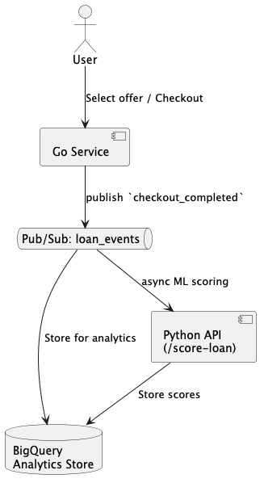

# Data Flow

This document outlines how Loan Buddy system supports downstream analytics, ML workflows and experimentation (eg. A/B testing)
by emitting structured events.

---

## Key events

| Event Name          | Trigger                         | Description                                      |
|---------------------|----------------------------------|--------------------------------------------------|
| `loan_selected`     | User selects a loan offer       | Logs user's intent and preferences               |
| `checkout_completed`| Checkout succeeds (Go → Python) | Final order including status (APPROVED/REJECTED) |

These events are candidates for publication to a messaging system.

---

## ☁️ Event Flow Architecture (Async)

---

## Benefits of this design

* Supports data-driven decision making
* Async-ready for resilience and decoupling
* Enabled event replay for fault recovery and auditing
* Enables A/B testing by emitting structured events which can help analytics teams to compare behavior